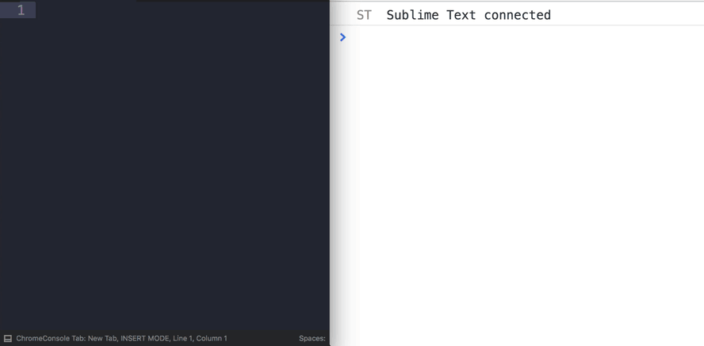

# ChromeREPL

  

A SublimeText 3 Plugin to use Chrome as your [REPL](https://en.wikipedia.org/wiki/Read%E2%80%93eval%E2%80%93print_loop).

Execute JavaScript in your browser. Interact with your running webapps. Live code your brains out!

### Why?

Because Chrome ain't no text editor. Anything longer than a line is a pain, and so is recalling what you typed earlier.

## Installation

Via Package Control (recommended! 👍👍👍)

Alternatively, clone this repo into your  `Packages` directory. e.g. `~/Library/Application Support/Sublime Text 3/Packages/` on macOS. If you do this you will need to open the Command Palette and run `Package Control: Satisfy Dependencies`.

## Starting Chrome

Chrome needs to be started with a special flag 🏳️ (`--remote-debugging-port`).

Don't worry, commands are provided to do this for you 😅.

1. If you haven't opened Chrome, use the `Chrome REPL: Start Chrome` command.
2. If Chrome is already running, use `Chrome REPL: Restart Chrome with remote debugging`*

>**this will quit and re-open Chrome, if you want to preserve your tabs, make sure you have set this behaviour in Chrome's settings: `On start-up: Continue where you left off`.*

## Usage

1. Start/Restart Chrome as above
2. Run the `Chrome REPL: Connect to Tab` command
3. Select the tab you want to connect to
4. You should see `"Sublime Text connected"` in the Chrome Developer Tools console
5. Use <kbd>Shift</kbd> <kbd>Enter</kbd> in Sublime Text to execute JavaScript code:
    - If you have nothing selected it will execute the current line
    - With code selected it will execute just the selection

>Note: Each Sublime tab can be connected to one Chrome tab. The connected tab is displayed in Sublime in the status bar at the bottom of tab.

### Additional commands

- `Clear Console` <kbd>Cmd/Ctrl</kbd> <kbd>Shift</kbd> <kbd>C</kbd>
- `Reload Page` <kbd>Cmd/Ctrl</kbd> <kbd>Shift</kbd> <kbd>R</kbd>
- `Reload Page (Ignore Cache)` <kbd>Cmd/Ctrl</kbd> <kbd>Shift</kbd> <kbd>Alt</kbd> <kbd>R</kbd>

## Settings

- 📁 Path to Chrome (can be Chrome, Canary, or Chromium)
- 👀 Automatically focus on connected Chrome tab (requires `wmctrl` on Linux)
- 🔧 Automatically opening the Developer Tools for every new window
- 🏳️ Additional chrome flags
- ⌨️ Enabling the [Command Line API](https://developers.google.com/web/tools/chrome-devtools/console/command-line-reference)
- 🏠 Custom hostname and port

## Thanks

The project was inspired by [SublimeWebInspector](https://github.com/sokolovstas/SublimeWebInspector/tree/master), but is far less ambitious, not as opinionated, and thus easier to maintain.

This uses a *ever so slightly* modified version of [PyChromeDevTools](https://github.com/marty90/PyChromeDevTools), and a stripped down version of [Sublime Goto Window](https://github.com/ccampbell/sublime-goto-window).

## Known Issues

This plugin relies on [psutil](https://github.com/giampaolo/psutil). The latest version of psutil requires Python 3.4. This means we are stuck with 5.4.1 which has a [known issue](https://github.com/giampaolo/psutil/issues/1044) on macOS to do with zombie processes. If the only option in the command palette is `Restart Chrome` then you may need to reboot your machine to clear the issue.

## Author

Arthur Carabott - [arthurcarabott.com](https://arthurcarabott.com)

